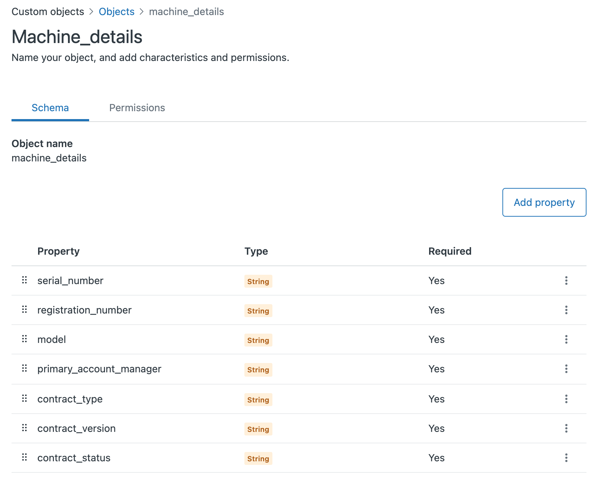
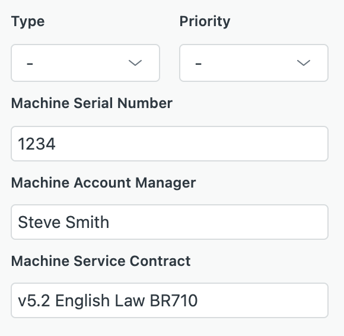
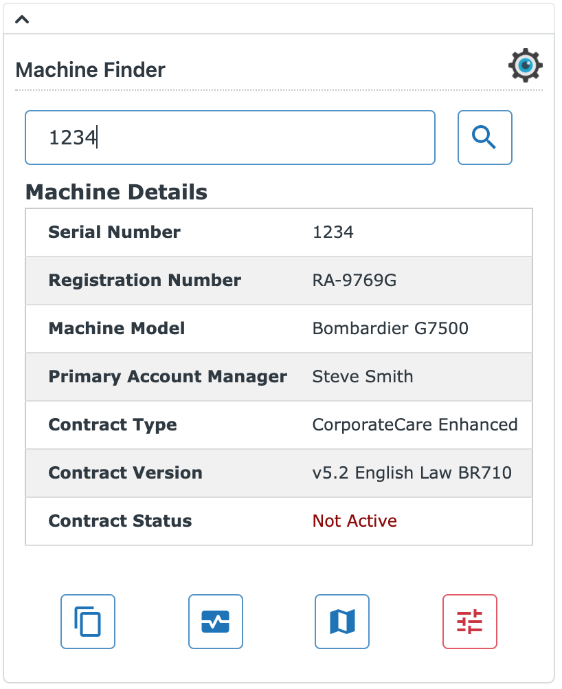
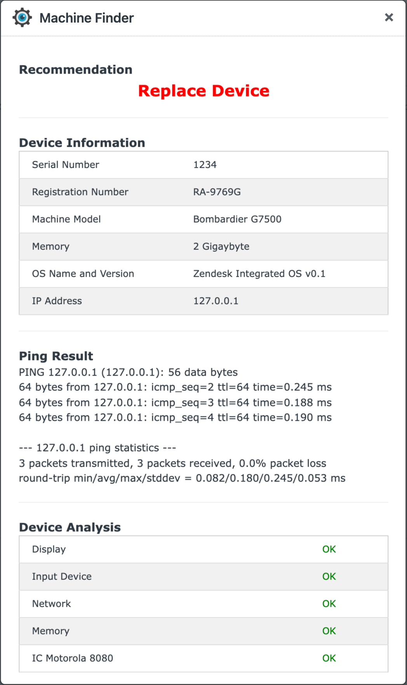
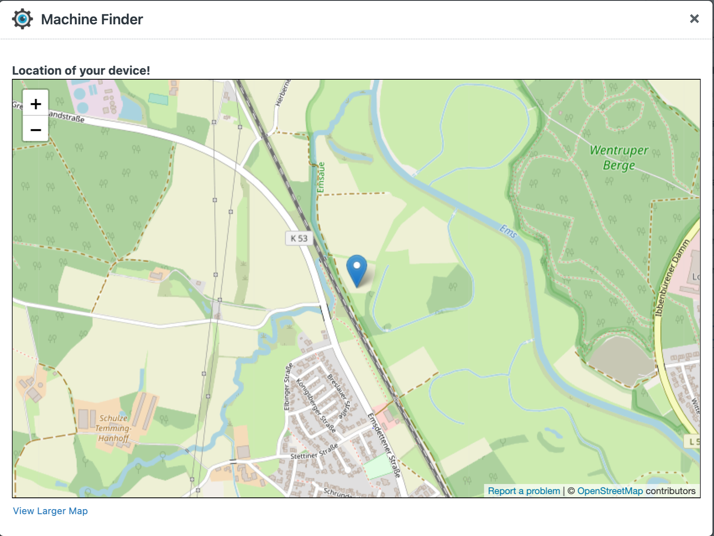
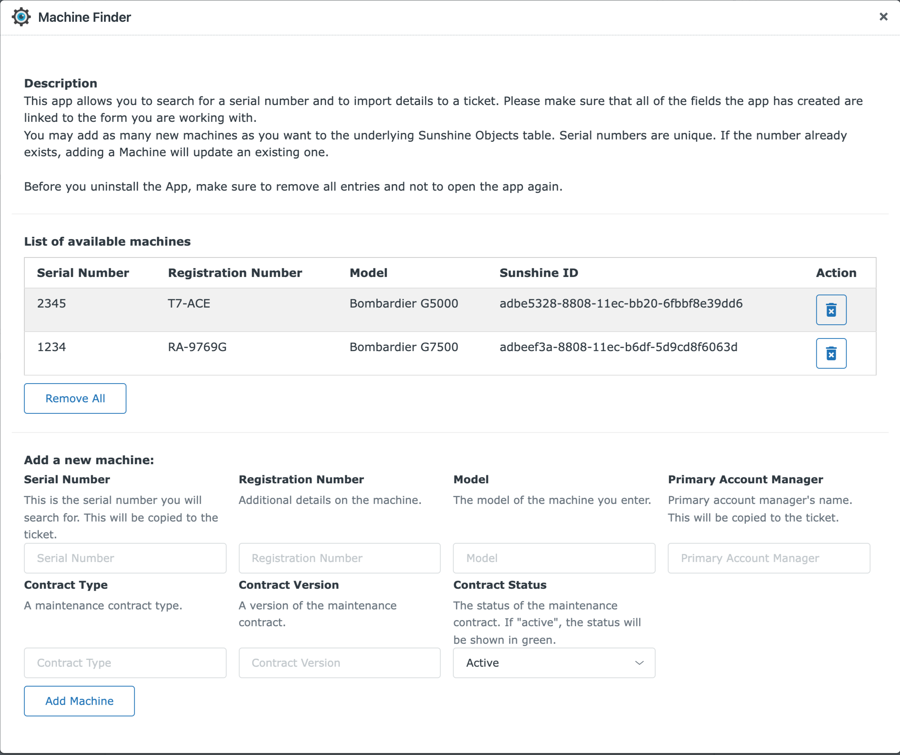

# Machine Finder

## Description
The App allows you to show the following use-cases to your customer during a demo.

- Search for a device in local database (Sunshine)
- Copy details from found machine to the ticket
- Emulate a Remote Diagnostics for the found machine
- Emulate a Locate Device on map for the found machine

From an admin perspective, you may add as many machines/devices as you want. All machines will be stored in a Sunshine table in your Zendesk instance. 

## Functional Details
### Prerequisites
The App stores data in a Sunshine table. The table will be created automatically upon installation. Every time the app runs, it will check whether there are objects stored in the table. If there are no objects stored, the app will create two default entries. 

&#8203

For saving machine details into a ticket, the app also creates three fields that it used. Make sure you have those fields in any form you want to use.

&#8203
The app uses your browser's location services for displaying a location on an OpenStreetMap. Make sure you grant access when asked for it.

&#8203

&#8203

### Search Device

#### New Ticket
The frst time you open a ticket, you may search for a machine (stored in your Sunshine table). Machine details will be shown in a table.

If not found a message will be shown. 
You will now be able to copy machine details to the ticket (see next chapter)

&#8203

#### Existing Ticket
If you have stored machine details in the ticket, those will be re-used. Next time a ticket is opened, these details will be used to perform the search automatically. Again, found information will be shown. 

&#8203

&#8203

### Copy Details to Ticket
You may copy details from the found machine table to the ticket you are working on. As mentioned above, the app uses three fields to store the details. 
There is no configuration option for those fields as they come with the app.

&#8203

&#8203

### Remote Diagnostics
Remote diagnostics is a fake. Basically there is a small animation which simulates a remote connection and analysis. After a few seconds, the animation is being removed and the result is shown. There will always be a static part in the result and a dynamic one, which is based on the machine you have selected. 

&#8203

&#8203

### Locate Device
The location of your device is a fake one. The app will use your browser's location and will show that on the map. Any device you open will show the same location and it might not even be your real one (depending on how you are online). 
You get the idea behind this functionality. 
For demo purposes, you can open the location in a bigger browser window.  

**The app uses OpenStreetMap rather than Google Maps, simply for licensing reasons.**

&#8203

### Configuration
As for any Zendesk app, you may want to limit access to it. Use default options to do that.
Additionally, the app allows you to add or remove entries using the configuration option it provides. This enables you to make a more tailored presentation when using the app. You can only add machines/devices, but you cannot change menu names, etc. 

&#8203

### Uninstall
Before you try to uninstall the app, make sure there are **no entries in Sunshine's object table** used by the app. Since the app has created the table, it will also remove the table during uninstall. This can only be done for empty tables.
The app allows you to remove all entries in the configuration dialog. Once you removed all entries, make sure that you don't open the app again (see Prerequisites section to understand why).

Also, be aware that all fields the app has created will be removed as well. 

You may now uninstall the app!

&#8203

## Demo
See a working demo.

<video src="Documentation/demo.mp4" width=100%/>

&#8203

## Change Log

### 2022-02-07
First working version released
